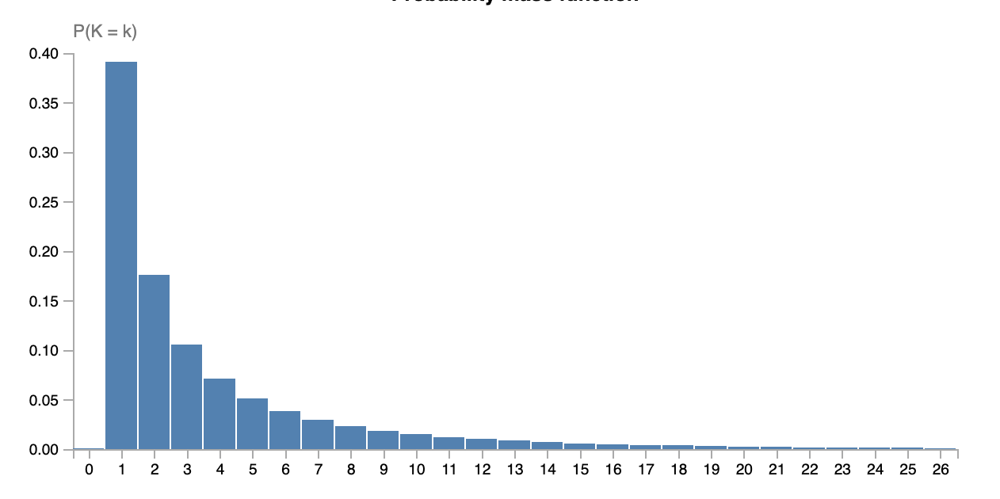
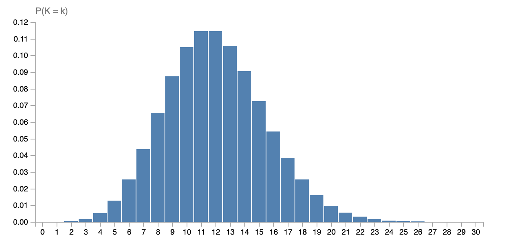

# Distributions

{: .motivation }
When considering the way the different probabilities are distributed over the outcomes of a random variable, many (real-world)
random variables tend to follow very similar patterns. Often so much so, that we can describe their distribution using a 
predefined function with only a few parameters needed to specify the exact shape - e.g. the normal distribution that needs only
a mean and a standard deviation. 

One of the key objects we look at in statistics is **distributions**. Suppose we have some random variable $$X$$ which has support 
$$\mathbb{N}$$, i.e. we have probabilities for outcomes $$X=1$$, $$X=2$$, and so on. We can visualize the probability 
of the outcomes of the events using the **probability mass function**, which simply 'plots' the probability values of each 
outcome as seen before. For example, our random variable could look something like this: 

  

This pmf gives us something we call a distribution, it quite literately tells how the 
different probability values are distributed over the outcomes of $$X$$. Now, the neat thing of statistics is 
that we can classify different random variables as being of the same type of distribution. 
It so turns out that in the actual world, a lot of processes tend to follow only a very select set of distributions. For example, 
the number of visits on this website per hour, the number of arrivals at the university per minute, and the number of books 
handed out by the library per day, all follow a so-called _Poisson_ distribution. Similarly, the height of a given person, 
grades obtained in some university course, and the age at which professional MMA fighters quit fighting in competitions, 
are all random variables following a _Normal_ distribution. If some random variable $$X$$ follows a distribution called 
$$\mathsf{Dist}(\theta)$$ we write $$X \sim \mathsf{Dist}(\theta)$$, where $$\theta$$ denotes any extra information 
needed to specify the distribution. As you may have encountered before, a normal distribution is specified using two parameters:
the mean of the distribution ($$\mu$$) and its standard deviation ($$\sigma$$). This means that when we know - or assume - our 
data is normally distributed, we only need to find two parameter values to specify the entire distribution. This gives rise to 
a typical machine learning scenario: we are interested in describing the distribution of some random event using a distribution we choose, we collect data of
that event, and then need to estimate the parameters that specify the exact distribution.

## Poisson distribution

The distribution we will look at first is the Poisson distribution. To specify a Poisson distribution, we need one parameter 
called the 'rate' of the distribution. We write $$X \sim \mathsf{Pois}(\lambda)$$ to denote that random variable $$X$$ follows 
a Poisson distribution with rate parameter $$\lambda$$. Here you see the probability mass function of $$\mathsf{Pois}(12)$$:

  

The pmf of the Poisson is given by:

$$p_X(x) = \frac{\lambda^x e^{-\lambda}}{x!}.$$

{: .exercise }
Show that this is indeed a pmf, i.e. each outcome has a probability greater than or equal to $$0$$ and all outcomes sum up to $$1$$. 
Explain how to choice of $$\lambda$$ does affect the shape of the distributions, but not the fact that they are distributions.

Poisson distribution are very common, especially when describing how often some event occurs per unit of time, as seen in the
examples above. If we now know the $$\lambda$$ which describes the Poisson of the process we care about, 
we can tell how likely all the different outcomes of the experiment are. That is, we could then assess how likely is it that
for instance our website gets more than 10,000 visitors per hour, which could help us decide whether or not it should be moved
to a bigger server.

That's not all. Since we have a clean formula for the pmf,
we can also reason about Poissons in general. For example, the mean of a Poisson is always $$\lambda$$, 
and the mode (i.e. highest value) is always $$\lfloor \lambda \rfloor$$, among other things.[^1] This means that we can also
answer basic questions about our distribution, such as that on average we expect $$\lambda$$ visits on our site per hour. 
It might therefore also not come as a surprise that a common estimate for the $$\lambda$$ parameter - the so called MLE estimate
which we be covered in the next section - is actually given by the mean of the data. That is, following a certain principle (MLE)
one would estimate $$\lambda$$ to be the mean of all observations.

Now you may wonder: how do we find these parameters $$\theta$$ in general? This is exactly the point where we
move into statistics rather than probability theory: we want to use data to find these $$\theta$$ values.
That is, suppose we have dataset $$\mathcal{D}$$ of observations, e.g. $$\mathcal{D} = \{2, 2, 3, 1, 2, 4, 5, 3, 5\}$$, 
we can use statistics (and machine learning) to find which $$\lambda$$ fits the data the best. 
This is done using techniques such as maximum likelihood estimation (MLE) and maximum a posteriori estimation (MAP).

{: .content }
In this section, we looked at distribution, why they are useful, and studied the Poisson distribution.

[^1]: Here, $$\lfloor \cdot \rfloor$$ is the 'floor function', simply around down the input to the nearest integer.
