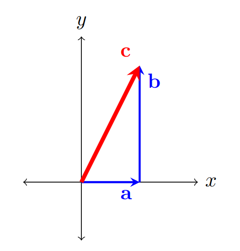

# Dot product

{: .motivation}
So far, we have only seen two operations we can do with vectors: addition of vectors and multiplication of vectors by a scalar.
The two operations combined allowed us to form a definition of a linear combination and basis. However, a vector space can be equipped with an inner product to allow for more operations. In this section, we will introduce the dot product, which is one of the most important operations in linear algebra.

A vanilla vector space does not have any other operations that involve two vectors. However, a vector space can be equipped 
with an inner product to form an inner product space. A inner or[^1] dot product between vectors $$\mathbf{v} = \begin{bmatrix}a_1, \cdots, a_n\end{bmatrix}^\text{T}$$ and $$\mathbf{w} = \begin{bmatrix}b_1, \cdots, b_n\end{bmatrix}^\text{T}$$ is defined as follows:[^2]

$$\mathbf{v} \cdot \mathbf{w} = a_1 b_1 + \cdots + a_n  b_n =  \sum_{i=1}^n a_i  b_i.$$

To see the benefit and the interpretation of the dot product, let's take a closer look at a case when we calculate a dot product of a vector with itself:

$$\mathbf{v} \cdot \mathbf{v} =   \sum_{i=1}^n a_i a_i = \sum_{i=1}^n a_i^2.$$

What we can see from this is that this corresponds to the squared norm/magnitude of the vector $$\mathbf{v}$$. 
The usual notation for the norm of a vector is $$\left\lVert \cdot \right\rVert$$, so we can write:

$$\left\lVert\mathbf{v}\right\rVert =  \sqrt{\sum_{i=1}^n a_i^2} \Longrightarrow \left\lVert\mathbf{v}\right\rVert  =\sqrt{\mathbf{v} \cdot \mathbf{v} }.$$

As a simple example, let's imagine that we have a 2D vector $$\mathbf{c} = \mathbf{a}+\mathbf{b}$$, where $$\mathbf{a} = \begin{bmatrix}a,0\end{bmatrix}^\text{T}$$ 
and $$\mathbf{a} = \begin{bmatrix}0,b\end{bmatrix}^\text{T}$$, as shown in the figure below:

  

 If we calculate the dot product of the vector $$\mathbf{c}$$ with itself, we get:
 
$$\left\lVert\mathbf{c}\right\rVert^2 = a^2 + b^2,$$

 which is exactly the Pythagorean theorem in 2D. 

Besides being useful for calculating norms of vectors, dot product can be used as a measure of similarity. If we imagine 
two $$n$$-dimensional vectors $$\mathbf{v}$$ and $$\mathbf{w}$$, the angle $$\theta$$ between them can be calculated 
using the following formula:

$$\mathbf{v} \cdot \mathbf{w} = \left\lVert\mathbf{v}\right\rVert   \left\lVert\mathbf{w}\right\rVert \, \cos{\theta}$$

We can divide both sides by the norms of both vectors to get the expression for the cosine of the angle between the vectors:

$$\cos{\theta} = \frac{\mathbf{v} \cdot \mathbf{w}}{\left\lVert\mathbf{v}\right\rVert   \left\lVert\mathbf{w}\right\rVert} $$

When the cosine of the angle between two vectors is equal to $$1$$, the vectors are perfectly aligned (interpreted as being as 
similar as possible), and when it is equal to $$0$$, the vectors are perpendicular (interpreted as being as different as possible). 
This can be interpreted as a measure of similarity (often called the _cosine similarity_), which is often used in many areas, 
such as Natural Language Processing. 

{: .summary}
We have introduced a new operation we can use to manipulate vectors, the dot product. The dot product can be used to calculate the norm or magnitude of a vector, as well as the cosine similarity between two vectors. When the cosine similarity is 1, the vectors are perfectly aligned, while a cosine similarity of 0 indicates that the vectors are perpendicular. This is often used in various fields of machine learning.

[^1]: Inner product and a dot product are often used interchangeably, although there are subtle differences.
[^2]: The symbol T stands for the transpose operation, which can be considered a flip of the vector/matrix over the main diagonal.}