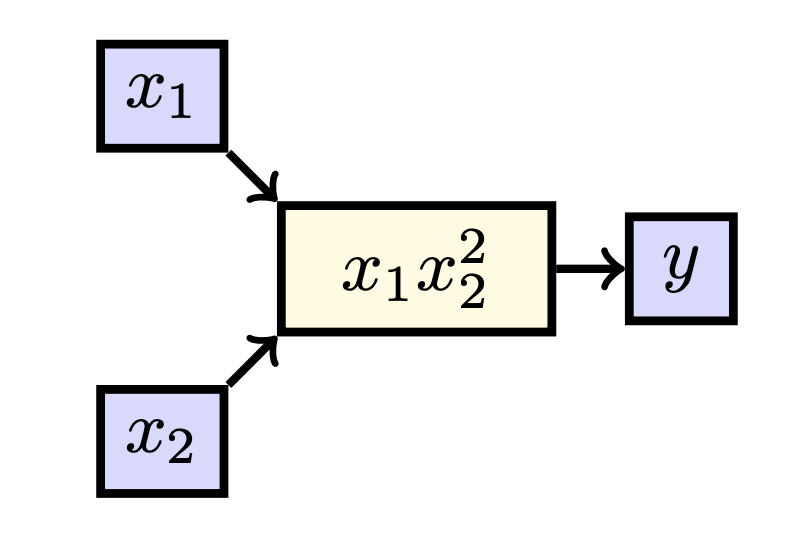
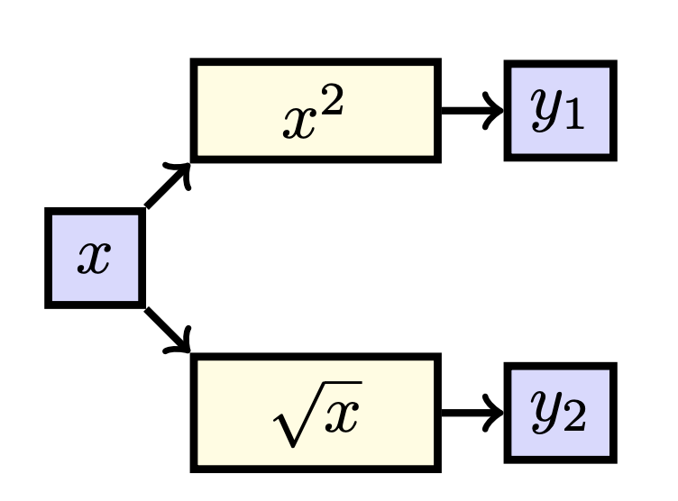
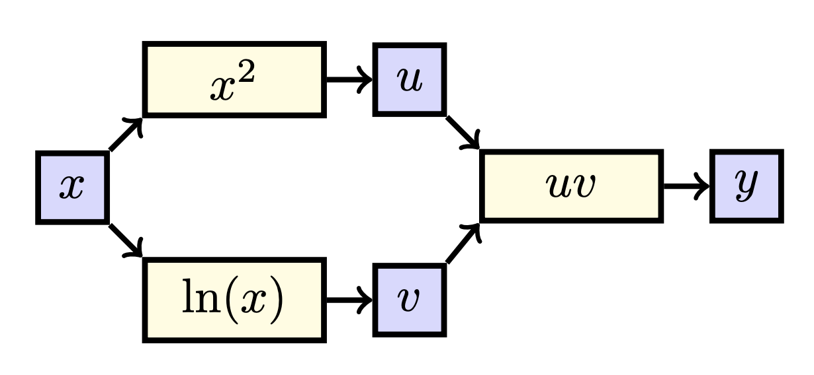
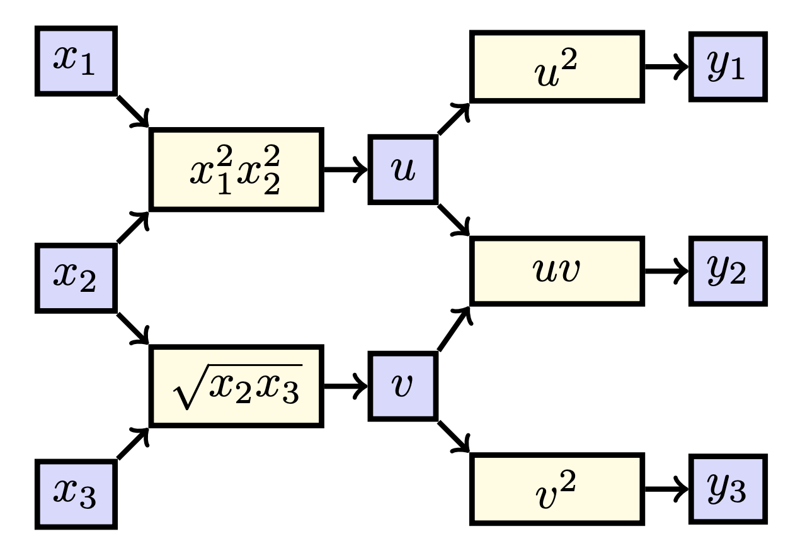

# Multivariate Derivatives

{: .motivation }

Often - especially in machine learning - we are working with functions with multiple input and/or outputs. In this section,
we study how our existing differentiation techniques extend to this multivariate case using our graphical representation
as introduced in the previous section.

Let's go one step further, and consider a function $$f: \mathbb{R}^2 \to \mathbb{R}$$ such that 
$$f: \begin{bmatrix}x_1 \\ x_2\end{bmatrix} \mapsto x_1x_2^2$$. We can again draw this function:

  

    
In this case, we can consider two derivatives: we can look at the effect of $$x_1$$ on $$y$$ and the effect of $$x_2$$ on $$y$$. 
When we can consider multiple derivatives for different variables, we do not write $$\frac{dy}{dx_1}$$ but rather 
$$\frac{\partial y}{\partial x_1}$$, to avoid confusion. We call such a derivative a **partial derivative**. 
Considering our earlier metaphor, a derivative in a real function is just the effect of turning a knob of a machine 
with one knob, whereas a partial derivative is an effect of turning one of the multiple knobs and keeping the other still. 
Luckily for us, we can still apply our same tricks and count the paths from a variable to $$y$$. 
In this case, we have that there is only one path from $$x_1$$ to $$y$$, and only one path from $$x_2$$ to $$y$$, giving us:

$$\frac{\partial y}{\partial x_1} = \frac{\partial x_1x_2^2}{\partial x_1} = x_2^2,$$

and

$$\frac{\partial y}{\partial x_2} = \frac{\partial x_1x_2^2}{\partial x_2} = 2x_1x_2.$$

Please note that since we only consider the influence of one variable at the time, all the other variables are **constant** when taking derivatives. 
What we sometimes do, is write the 'full' derivative $$\frac{d f}{d\textbf{x}}$$ as the following vector:

$$\frac{dy}{d\textbf{x}} = \begin{bmatrix} \frac{\partial f}{\partial x_1} & \frac{\partial f}{\partial x_2} \end{bmatrix} = \begin{bmatrix}x_2^2 & 2x_1x_2\end{bmatrix}.$$ 

We call this full derivative a **gradient** in the case we have functions $$f: \mathbb{R}^n \to \mathbb{R}$$, denoted as 
$$\frac{dy}{d\textbf{x}} = \nabla y (\textbf{x}) = \text{grad } y(\textbf{x})$$. However, in the the general case of 
functions $$f: \mathbb{R}^n \to \mathbb{R}^m$$ we call the resulting matrix a **Jacobian**, denoted as 
$$\frac{d\textbf{y}}{d\textbf{x}} = \mathbf{J}_\textbf{y}(\textbf{x})$$. 
The Jacobian is just the matrix which has on its $$i$$ row all the partial derivatives of $$y_i$$ with respect to $$x_j$$, i.e. 
$$\mathbf{J}_{ij} = \frac{\partial y_i}{\partial x_j}$$. Hence, since we only have one output here, we have that the 
Jacobian has only one row.[^1]

We can also have a function $$\textbf{f}: \mathbb{R} \to \mathbb{R}^2$$ which maps $$\textbf{f}: x \mapsto \begin{bmatrix}x^2 \\ \sqrt{x} \end{bmatrix}.$$ 
In this case, we have that $$\textbf{y} = \textbf{f}(x)$$ where $$\textbf{y}$$ is a vector (and hence is written in bold font), 
and thus we can consider $$y_1 = x^2$$ and $$y_2 = \sqrt{x}$$. Drawing this, we find:

  

    
    
When again looking at the paths, we see that

$$\frac{d y_1}{dx} = \frac{d x^2}{dx} = 2x,$$

and

$$\frac{d y_2}{dx} = \frac{d \sqrt{x}}{dx} = \frac{1}{2\sqrt{x}}.$$

Here we can also group the different derivatives into one matrix:

$$\frac{d\textbf{y}}{dx} = \begin{bmatrix} 2x \\ \frac{1}{2\sqrt{x}} \end{bmatrix}.$$

Please note that if we have a function $$f: \mathbb{R}^n \to \mathbb{R}^m$$ our Jacobian will be of the shape $$m \times n$$. 

Now we are finally ready to consider a function with multiple streams of influence. 
Consider the $$y = g(\textbf{h}(x))$$, where $$\textbf{h}(x) = (x^2, \ln (x))$$ and $$g(u, v) = uv$$. 
That is, $$y$$ is found by first calculating intermediate values $$u = x^2$$ and $$v = \ln (x)$$ and then finding 
$$y= uv.$$ If we draw these functions, we see the following:

  

    
It is now very clear that the effect of $$x$$ of $$y$$ is twofold: both through $$u$$ and $$v$$. As mentioned earlier, 
we need to consider all streams of influence. Specifically, we **sum** the different paths/effects, i.e.:

$$\frac{d y}{dx} = \frac{\partial y}{\partial u} \frac{du}{dx} + \frac{\partial y}{\partial v} \frac{dv}{dx}.$$

Plugging everything in, we find

$$\frac{d y}{dx} = \frac{\partial y}{\partial u} \frac{du}{dx} + \frac{\partial y}{\partial v} \frac{dv}{dx} = v \cdot 2x + u \cdot \frac{1}{x} = \ln(x) \cdot 2x + x^2 \cdot \frac{1}{x} =  2x (\ln (x) + \frac{1}{2}).$$

You may recognize this as the product rule, now you know where that comes from!

{: .exercise }
Suppose $$\textbf{f}: \mathbb{R}^3 \to \mathbb{R}^3$$ such that 
$$f(x_1, x_2, x_3) = \textbf{h}(\textbf{g}(x_1, x_2, x_3))$$, where $$\textbf{g}(x_1, x_2, x_3) = (x_1^2x_2^2, \sqrt{x_2x_3})$$ 
and $$\textbf{h}(u, v) = (u^2, uv, v^2)$$. Find $$\frac{\partial y_2}{\partial x_2}$$. Hint: draw out what happens.

When visualizing this function, we get the following:

  

    
When counting the paths from $$x_2$$ to $$y_2$$, we find two paths: one through $$u$$ and one through $$v$$. We hence find

$$\frac{\partial y_2}{\partial x_2} = \frac{\partial y_2}{\partial u} \frac{\partial u}{\partial x_2} + \frac{\partial y_2}{\partial v} \frac{\partial v}{\partial x_2}.$$

Plugging our derivatives, we find

$$\frac{\partial y_2}{\partial x_2} = v \cdot 2x_1^2x_2 + u \cdot \frac{x_3}{2\sqrt{x_2x_3}} = 2x_1^2 x_2 \sqrt{x_2x_3} + \frac{x_1^2 x_2^2x_3}{2\sqrt{x_2x_3}}.$$

Sweet! We now know how to find derivatives in multivariate functions. As you have seen, this approach is quite a time intensive, 
and sometimes (especially in deep learning) it is not necessary to write out everything by hand like this. 
This will be the topic of the rest of this section.

{: .summary }
In this section we extended our graphical interpretation of derivatives to functions $$f: \mathbb{R}^m \to \mathbb{R}^n$$.

[^1]: For pedagogical reasons, we will call all such higher-order derivatives of $y$ Jacobians and denote them with $$\frac{d\textbf{y}}{d\textbf{x}}$$, but in practice, most people will just use the word 'gradient' here anyway.