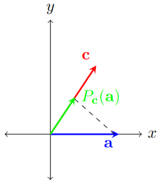

# Orthogonal projections and orthoronormal basis

{: .motivation}
When dealing with vectors, often we wish to know how much is one vector composed of the other. This description fits well with the properties of the dot product. An intuitive way to measure this is by using an orthogonal projection. For example, let's imagine we have two vectors, a vector $$\mathbf{a}$$ and a vector $$\mathbf{c}$$, and we wish to project the vector $$\mathbf{a}$$ onto $$\mathbf{c}$$. We can visualize the orthogonal projection in the following way. First, we turn on a light and point it perpendicular to the vector we are projecting on (vector $$\mathbf{c}$$) and place it behind the vector we are projecting (vector $$\mathbf{a}$$). After turning on the light, vector $$\mathbf{a}$$ will cast a_shadow_onto vector $$\mathbf{c}$$, and this _shadow_ corresponds to the projection. An example of the projection can be seen in Figure [1](#fig:orthogonal); here we can think of the green vector as the aforementioned _shadow_.

## Projections

  

Figure 1:  _A visualization of the orthogonal projection of the vector $$\mathbf{a}$$ onto the vector $$\mathbf{c}$$, denoted as $$P_{\mathbf{c}}(\mathbf{a})$$. The black dashed line visually represents the projection operation._

Formally, a projection on a vector space $$V$$ is a linear operator $$P:V \to V$$[^1], such that $$P^2 = P$$. In other words, projections are operators which do not do anything new if applied more than once. In the context of the orthogonal projection shown in Figure \ref{fig:orthogonal}, once we project the vector $$\mathbf{a}$$ onto $$\mathbf{c}$$, performing another projection will yield the same vector $$P_{\mathbf{c}}(\mathbf{a})$$. 

This definition of a projection is very general, and orthogonal projections are only a subset of possible projections. Namely, orthogonal projections are operators which satisfy the property
$$
P^2 = P = P^{\text{T}}.
$$
Orthogonal projections also do not have to be projections of vectors onto another vector. For example, we could project a vector $$\mathbf{v} = [x,y,z]^{\text{T}} \in \mathbb{R}^3$$ to the $$xy$$-plane using the following operator:

$$
P = \begin{bmatrix}
    1 & 0 & 0 \\
    0 & 1 & 0 \\
    0 & 0 & 0 \\
\end{bmatrix}
$$

As an exercise, verify that this operator projects any $$\mathbf{v} \in \mathbb{R}^3$$ to the $$ xy$$ plane, and that this operator is indeed an orthogonal projection. 

{: .proof}
>First, we will check whether this operator maps an arbitrary vector to the $xy$-plane:
> 
>$$
P \mathbf{v} = \begin{bmatrix}
    1 & 0 & 0 \\
    0 & 1 & 0 \\
    0 & 0 & 0 \\
\end{bmatrix}\begin{bmatrix}
    x\\
    y \\
    z \\
\end{bmatrix} = \begin{bmatrix}
    x\\
    y \\
    0 \\
\end{bmatrix}
$$
> 
>   We can see that the $z$ component of the vector is equal to zero, which means that the resulting vectors lie in the $$ xy$$ plane. 
> 
>Next, we will check whether this operator is a projection, i.e. we need to verify whether $$P^2 = P$$.
>
>$$P^2 = \begin{bmatrix}
    1 & 0 & 0 \\
    0 & 1 & 0 \\
    0 & 0 & 0 \\
\end{bmatrix}\begin{bmatrix}
    1 & 0 & 0 \\
    0 & 1 & 0 \\
    0 & 0 & 0 \\
\end{bmatrix} = \begin{bmatrix}
    1 & 0 & 0 \\
    0 & 1 & 0 \\
    0 & 0 & 0 \\
\end{bmatrix} = P
$$
> 
>   Finally, we need to check whether the projection is orthogonal, and we do so by checking whether $$P = P^{\text{T}}$$ holds. This is trivial since the matrix is diagonal, so the transposed matrix is by default equal to the original matrix. Thus, this projection is indeed an orthogonal projection.

However, in most cases, we will be interested in orthogonal projections onto vectors. As motivated at the beginning of the section, we denote the projection of the vector $$\mathbf{a}$$ onto vector $$\mathbf{c}$$ as $$P_{\mathbf{c}}(\mathbf{a})$$. The projection itself is a vector pointing in the same direction as the vector $$\mathbf{c}$$ whose length is the ratio of the vector $$\mathbf{a}$$ which is parallel to the vector $$\mathbf{c}$$. For this reason, we can also denote the projection as $$\mathbf{a}_{\lVert}$$[^2]. From trigonometry, we know that the magnitude of the projection is equal to

$$
\lVert \mathbf{a}_{\lVert}\rVert= \lVert \mathbf{a}\rVert\, \cos{\theta_{a,c}},
$$

where $$\theta_{a,c}$$ is the angle between vectors $$\mathbf{a}$$ and $$\mathbf{c}$$. On the other hand, we know how to calculate the cosine between two vectors using the dot product, which tells us:

$$
\mathbf{a} \cdot \mathbf{c} = \lVert\mathbf{a}\rVert  \lVert\mathbf{c}\rVert \cos{\theta_{a,c}} \Longrightarrow  \lVert\mathbf{a}\rVert \cos{\theta_{a,c}} = \frac{\mathbf{a} \cdot \mathbf{c} }{\lVert\mathbf{c}\rVert}
$$

Using these results, we can write the orthogonal projection as:

$$
P_{\mathbf{c}}(\mathbf{a}) = \frac{\lVert \mathbf{a}_{\lVert}\rVert}{\lVert \mathbf{c} \rVert} \, \mathbf{c} = \left(\frac{\mathbf{a} \cdot \mathbf{c} }{\lVert\mathbf{c}\rVert \cdot \lVert\mathbf{c}\rVert}\right) \mathbf{c}. 
$$

In most cases, however, we will project onto unit vectors (vectors whose magnitude is equal to $$1$$), as it allows for more neat calculations. We can achieve that every vector has a unit length, and this is called normalization. In order to normalize a vector, we need to divide it by its magnitude. If we denote the normalized version of the vector $$\mathbf{c}$$ as $$\mathbf{u}_c$$, then the orthogonal projection onto the unit vector can be rewritten as 

$$
P_{\mathbf{c}}(\mathbf{a}) = \left(\frac{\mathbf{a} \cdot \mathbf{c} }{\lVert\mathbf{c}\rVert\cdot \lVert\mathbf{c}\rVert}\right) \mathbf{c} =  \left(\mathbf{a} \cdot \frac{\mathbf{c}}{\lVert\mathbf{c}\rVert}\right)\frac{\mathbf{c}}{\lVert\mathbf{c}\rVert}  =  \left(\mathbf{a} \cdot \mathbf{u}_c\right) \mathbf{u}_c,
$$

which provides a much simpler formula. We have discussed that the orthogonal projection is a linear operator, and we know that linear operators can be written matrix form. As an exercise, verify that the orthogonal projection of an arbitrary vector onto a normalized vector $$\mathbf{u}$$ can be written as:

$$
P_{\mathbf{u}} = \mathbf{u}\mathbf{u}^{\text{T}}
$$

{: .proof}
>Let's assume that we wish to project a vector $$\mathbf{a}$$ onto the normalized vector $$\mathbf{u}$$. We can always decompose vector the vector $$\mathbf{a}$$ in two components: one being parallel to the vector $$\mathbf{u}$$ and one being perpendicular to $$\mathbf{u}$$. We can then write $$\mathbf{a} =  \mathbf{a}_{\lVert} + \mathbf{a}_{\perp}$$.  Applying the assumed projection matrix gives the following:
>
>$$
        \begin{split}
            P_{\mathbf{u}} \, \mathbf{a} &= P_{\mathbf{u}}\left( \mathbf{a}_{\lVert} + \mathbf{a}_{\perp}\right) \\
            &\stackrel{1}{=} P_{\mathbf{u}}\,\mathbf{a}_{\lVert}+P_{\mathbf{u}}\, \mathbf{a}_{\perp} \\
            &\stackrel{2}{=} \mathbf{u}\mathbf{u}^{\text{T}}\mathbf{a}_{\lVert}+\mathbf{u}\mathbf{u}^{\text{T}}\mathbf{a}_{\perp} \\
            &\stackrel{3}{=} (\mathbf{u})\mathbf{u}^{\text{T}}\mathbf{a}_{\lVert}+(\mathbf{u})\mathbf{u}^{\text{T}}\mathbf{a}_{\perp} \\
            &\stackrel{4}{=} (\mathbf{u})\mathbf{u}\cdot \mathbf{a}_{\lVert}+(\mathbf{u})\mathbf{u}\cdot\mathbf{a}_{\perp} \\
            &\stackrel{5}{=} (\mathbf{u}) \lVert\mathbf{a}_{\lVert}\rVert+0\\
            &\stackrel{6}{=} \mathbf{a}_{\lVert},
        \end{split}
$$
> 
>where the following properties in each step were used:
>
> 1. Linearity of the operator $$ P_{\mathbf{u}}$$.
> 2. Definition of the operator $$P_{\mathbf{u}}$$.
> 3. Associativity of the multiplication.
> 4. The dot product can be equivalently written as $$\mathbf{v} \cdot \mathbf{w} = \mathbf{v}^{\text{T}}\mathbf{w}$$.
> 5. The dot product of the perpendicular component $$\mathbf{u}\cdot\mathbf{a}_{\perp}$$ is by definition equal to zero, whereas the dot product of the parallel component $$\mathbf{u}\cdot \mathbf{a}_{\lVert}$$ is simply equal to the length of the parallel component, since $$\mathbf{u}$$ is a unit vector.
> 6. The parallel component points in the direction of $$\mathbf{u}$$ and has a magnitude $$\lVert\mathbf{a}_{\lVert}\rVert$$, so by definition this is equal to $$\mathbf{a}_{\lVert}$.$
>
> Therefore, we have shown that the orthogonal projection onto an arbitrary vector $$\mathbf{u}$$ can indeed be written in the matrix form as $$P_{\mathbf{u}} = \mathbf{u}\mathbf{u}^{\text{T}}$$.

## Orthonormal basis
In linear algebra, an orthonormal basis is a special type of basis that has two important properties: all vectors have unit lengths, and all basis vectors are perpendicular to each other. The name orthonormal means orthogonal and normalized at the same time. Formally, let's denote the orthonormal basis in $$\mathbb{R}^n$$ as a set $$\{ \mathbf{u_1},  ... , \mathbf{u}_n\}$$. Then, these properties can be written compactly as:

$$
\mathbf{u}_i \cdot \mathbf{u}_j=\begin{cases}
			1, & i=j\\
                0, & i\neq j
		 \end{cases}.
$$

Orthonormal bases are very important because they provide a consistent way to represent vectors, and allow for simpler calculations in certain cases. As an example, let's imagine we have an orthonormal basis  $$\{ \mathbf{u_1},  ... , \mathbf{u}_n\}$$, and we wish to represent an arbitrary vector $$\mathbf{v} = [v_1,  ... , v_n]^{\text{T}}$$ in this basis. We do so by writing the vector $$\mathbf{v}$$ as a linear combination of the orthonormal basis vectors:

$$
\mathbf{v} = \sum_i c_i \mathbf{u}_i,
$$

where the coefficients $$c_i$$ are unknown. Now, let's take the dot product of both sides with the vector $$\mathbf{u}_j$$:

$$
\mathbf{v} \cdot \mathbf{u}_j = c_1( \mathbf{u}_1 \cdot \mathbf{u}_j) +  ...  + c_j (\mathbf{u}_j \cdot \mathbf{u}_j) +  ...   +c_n (\mathbf{u}_n \cdot \mathbf{u}_n) .
$$

 Since the basis is orthonormal, this means that one the right-hand-side,
 only the term $$i=j$$ will be non-zero. Therefore we have:

$$
 c_j=\mathbf{v} \cdot \mathbf{u}_j 
$$

 We can see that evaluating coefficients in the expansion is very simple when using an orthonormal basis: each coefficient is equal to the dot product of the vector $$\mathbf{v}$$ with its corresponding basis vector. In the case of general basis, we would have to solve a system of linear equations in order to find coefficients of the expansion, which is much more complex. 

[^1]: This is a standard mathematical notation that means the following: a function $f$ takes as an input a vector from the vector space $$V$$ and outputs a vector from a vector space $$V$$.
[^2]: The $$\lVert$$ symbol denotes that this is the component of the vector $$\mathbf{a}$$ which is parallel to $$\mathbf{c}$$.