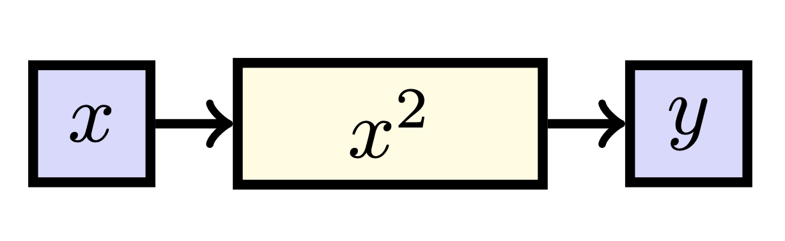
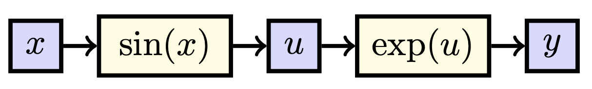
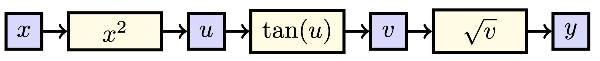

# Univariate Derivatives

{: .motivation }
In this section, we introduce a visualization for computing derivatives of functions $$f: \mathbb{R} \to \mathbb{R}$$. 
Not only will form the basis for both computing higher dimensional derivatives, but it will also get you in the habit of
thinking graphically about functions. This will be especially useful when doing deep learning later.

Let us start nice and easy with our basic functions over the reals, i.e. functions $$f: \mathbb{R} \to \mathbb{R}$$. 
Though this initially may look superfluous, we will introduce a visual way of representing these functions. This new 
approach will make it easier to consider multivariate functions and is commonplace in machine learning. Consider the 
function $$f$$ such that $$f: x \mapsto x^2$$, i.e. the function that squares its input. Again, our output is given by 
$$y = f(x) = x^2$$. In our example, we can visualize this function as follows: 

  

The blue squares represent **values** and the yellow rectangles represent ways to **determine** a value. 
The most important insight you should take away is that the sensitivity of $$y$$ to $$x$$ is given by the sum of influences 
of all the paths from $$x$$ to $$y$$. In this case, there is only one path, which is through the function $$x^2$$. Using basic 
differentiation techniques, we hence observe that:

$$\frac{dy}{dx} = \frac{dx^2}{dx} = 2x.$$

A slightly more _spicy_ example if the function $$f: \mathbb{R} \to \mathbb{R}$$ such that $$f: x \mapsto \exp (\sin (x))$$.[^1]
If we make a diagram of this function as above, we can represent it as follows:

  

Please note that we had to introduce a new variable $$u:= \sin (x)$$ that represents the intermediate value found after 
applying the sine function to $$x$$. When finding the derivative of $$y$$ with respect to $$x$$, we again count all the paths 
from $$x$$ to $$y$$. Again, there is only one path, now going through our intermediate value $$u$$. In this case, the effect 
of $$x$$ on $$y$$ is equal to the effect of $$x$$ on $$u$$ times the effect of $$u$$ on $$y$$, i.e.

$$\frac{dy}{dx} = \frac{dy}{du} \frac{du}{dx}.$$ 

You may have encountered this separation of derivatives before as the **chain rule**. These derivatives are quite simple, giving us

$$\frac{dy}{dx} = \frac{dy}{du} \frac{du}{dx} = \exp(u) \cdot \cos (x) = \exp (\sin (x)) \cos (x),$$

where we substituted $$u = \sin (x)$$ in the last step. So, we **sum** all the paths from $$x$$ to $$y$$, and we
**multiply** the intermediate effects, e.g. if $$x$$ influences $$u$$ which influences $$y$$, the influence of $$x$$ on $$y$$ 
is the influence of $$x$$ on $$u$$ times the influence of $$u$$ on $$y$$.

{: .exercise }
Let $$f: \mathbb{R} \to \mathbb{R}$$ be the function defined by $$f: x \mapsto \sqrt{\tan (x^2)}$$. Draw the diagram corresponding
to this function and find $$\frac{df}{dx}$$. 

The corresponding diagram for this function is: 

  

Here, we defined $$u := x^2$$, $$v:= \tan u$$, and $$y := \sqrt{v}$$. The effect of $$x$$ on $$f$$ is given by the effect of $$x$$ on $$u$$ times
the effect of $$u$$ on $$v$$ times the effect of $$v$$ on $$y$$, i.e.
$$\frac{df}{dx} = \frac{dy}{dv} \frac{dv}{du} \frac{du}{dx}.$$

Using basic derivative techniques, we, therefore, conclude that 

$$\frac{df}{dx} = \frac{1}{2 \sqrt{v}} \cdot \frac{1}{\cos^2 u} \cdot 2 x.$$

Using our substitutions, we can write this as 

$$\frac{df}{dx} = \frac{1}{2 \sqrt{\tan (x^2)}} \cdot \frac{1}{\cos^2 (x^2)} \cdot 2 x = \frac{x}{\cos^2(x^2) \sqrt{\tan (x^2)}}.$$

[^1]: If you are not familiar with the $$\exp(x)$$ function, it is just another way to write $$e^x$$.

{: .summary }
In this section, you have seen: a graphical visualization of functions and derivatives, the chain rule of differentiation,
and the sum rule of differentiation in the context of standard functions $$f: \mathbb{R} \to \mathbb{R}$$.
